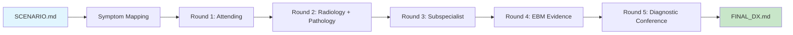

# CPS Skills — Clinical Problem Solving for Claude Code

[](https://claude.ai/claude-code)
[](https://python.org)
[](references.bib)
[](.claude/skills/cps/references/chapters/)
[](case/)

> [!NOTE]
> [English](README.md) | [繁體中文](README.zh-TW.md)

A [Claude Code](https://claude.ai/claude-code) skill that models the [NEJM Clinical Problem-Solving](https://www.nejm.org/clinical-problem-solving) format. Given a patient scenario, it runs multi-persona diagnostic rounds with Bayesian likelihood ratio reasoning, textbook-backed evidence, and literature search to produce a structured final diagnosis.

## How It Works



| Phase | Persona | What Happens |
|-------|---------|-------------|
| 1 | Attending (IM) | Problem representation, initial Top 10 DDx with pre-test probabilities |
| 2 | Radiologist + Pathologist | Imaging and lab interpretation with likelihood ratios |
| 3 | Subspecialist (auto-selected) | Cardiology, neurology, ID, or pulmonology deep analysis |
| 4 | EBM Specialist | WebSearch for current evidence, guidelines, meta-analyses |
| 5 | Diagnostic Conference | Consensus synthesis, Bayesian probability table, final diagnosis |

Each round applies **likelihood ratios** to update disease probabilities:

```
Post-test odds = Pre-test odds x LR
```

## Quick Start

```bash
# Create a patient scenario
mkdir -p case/my-case
cat > case/my-case/SCENARIO.md << 'EOF'
# 65M with Acute Chest Pain
## Chief Complaint
Substernal chest pain radiating to left arm, 2 hours
## Vital Signs
HR 110, BP 90/60, SpO2 94%
EOF

# Run the CPS skill in Claude Code
/cps case/my-case/SCENARIO.md
```

**Output:**
```
case/my-case/
├── SCENARIO.md           # Patient presentation
├── round-1.md            # Attending physician
├── round-2.md            # Radiology & pathology
├── round-3.md            # Subspecialty consultation
├── round-4.md            # Evidence synthesis
├── round-5.md            # Diagnostic conference
├── probability-table.md  # Bayesian probability cascade
└── FINAL_DX.md           # Final diagnosis + reasoning chain
```

## Features

### 8 Medical Personas

| Persona | Role | Activated When |
|---------|------|----------------|
| Attending (IM) | H&P synthesis, initial DDx | Always |
| Radiologist | Imaging interpretation | Imaging data present |
| Pathologist | Lab/biopsy interpretation | Lab data present |
| Cardiologist | ECG, echo, cath | Chest pain, dyspnea, syncope |
| Pulmonologist | PFTs, ABG, chest CT | Cough, dyspnea, wheezing |
| Infectious Disease | Cultures, serologies | Fever, immunocompromised |
| Neurologist | Neuro exam, brain imaging | Headache, dizziness, delirium |
| EBM Specialist | Literature search | Always |

### 33 Evidence-Based Chapter References

Clinical diagnostic data compiled from primary literature into 60-120 lines each, containing:
- Differential diagnosis frameworks with pivotal points
- Likelihood ratio tables (LR+/LR- for key findings)
- Diagnostic algorithms and clinical decision rules
- Must-not-miss diagnoses and red flags

### Bayesian LR Calculator

```bash
echo '{"diagnoses": [{"name": "ACS", "prior": 0.25, "must_not_miss": true,
  "findings": [{"name": "Troponin+", "lr": 11.0, "present": true}]}]}' \
  | python3 .claude/skills/cps/scripts/lr_calculator.py
```

### Safety Checks

Built from real case retrospectives where the skill initially failed:

| Check | Trigger | What It Does |
|-------|---------|-------------|
| Red Flag History | Unusual PMH (MI at <40) | Demand etiology before DDx |
| Syndromic Screen | Young patient, unclear etiology | Complete skin/eye/vascular exam |
| Rare Cause Search | Findings don't match common DDx | WebSearch for comprehensive reviews |
| Hypothesis Space Audit | After every round | "Is there a Dx NOT in our Top 10?" |
| Genetic Pattern Recognition | AD family history + vascular disease | Screen for genetic vasculopathies |
| Hypothesis Humility | Always | The DDx is never closed |

## Example Cases

### Case 1: 76F Dyspnea + Progressive Weakness

> 6-month progressive proximal weakness, bilateral ptosis, areflexia, respiratory failure

| Finding | LR | Probability |
|---------|-----|------------|
| Proximal weakness + areflexia | x5.0 | 35% -> 72.9% |
| Low/absent CMAPs | x8.0 | -> 95.6% |
| SIADH (autonomic) | x3.0 | -> 98.5% |
| Failed MG therapy | x4.0 | -> **99.6%** |

**Final Dx: Lambert-Eaton Myasthenic Syndrome (LEMS)**, paraneoplastic from SCLC

### Case 2: 38F Sudden Chest Pain — 5 Diagnostic Pivots

> Mail carrier with prior MI, sudden chest pain, NTG non-responsive

| Pivot | New Data | Leading Dx | Prob |
|-------|----------|-----------|------|
| 1 | Young F + prior MI | SCAD | 97.5% |
| 2 | Multi-territory MI + anemia | APS | 94.7% |
| 3 | 3-vessel coronary aneurysms | Kawasaki Disease | 90% |
| 4 | Skin papules noted | KD / Sarcoid / NF1 | 50% / 25% / 10% |
| 5 | CAL spots + freckling + neurofibromas | **NF1** | **>95%** |

**Final Dx: NF1 Vasculopathy** with diffuse coronary aneurysms

**Key lesson**: Bayesian reasoning only works within the hypothesis space you define. NF1 wasn't in the initial Top 10.

## Subcommands

| Command | Description |
|---------|-------------|
| `/cps SCENARIO.md` | Full 7-phase diagnostic workflow |
| `/cps discover [topic]` | Search NEJM CPC, BMJ for challenging cases |
| `/cps round [case-dir] N` | Add an additional diagnostic round |
| `/cps review [case-dir]` | Review and update an existing case |

## Project Structure

```
cps-skills/
├── .claude/skills/cps/
│   ├── SKILL.md                    # Main skill (303 lines)
│   ├── references/
│   │   ├── chapters/              # 33 distilled chapter references
│   │   ├── personas.md            # 8 persona definitions
│   │   ├── bayesian-reasoning.md  # LR formulas + clinical LR tables
│   │   ├── ddx-framework.md       # VINDICATE + must-not-miss
│   │   ├── rare-causes.md         # NF1, KD, SCAD, PXE, Fabry...
│   │   └── ...
│   └── scripts/
│       ├── init_case.py           # Case directory setup
│       ├── lr_calculator.py       # Bayesian probability calculator
│       └── extract_chapter.py     # Epub extractor (optional)
├── case/                          # Case outputs (teaching cases only)
├── .env.example                   # API keys for literature search
├── references.bib                 # BibTeX citations for clinical data sources
└── CLAUDE.md                      # Claude Code project instructions
```

## Optional: Literature Search

Configure API keys from [robust-lit-review](https://github.com/htlin222/robust-lit-review):

```bash
cp .env.example .env
# Fill in: SCOPUS_API_KEY, PUBMED_API_KEY, EMBASE_API_KEY, etc.
```

Without `.env`, the skill uses WebSearch only.

## Privacy

> [!CAUTION]
> **Never commit real patient data.** All cases in this repository are de-identified teaching scenarios. The `.gitignore` excludes common patient data patterns. When creating your own cases, use fictional or fully de-identified data only.

## References

Clinical data in the chapter references is sourced from peer-reviewed literature. All citations use pandoc-style `[@key]` format with entries in [`references.bib`](references.bib). Key sources include the JAMA Rational Clinical Examination series [@simel2009], evidence-based physical diagnosis literature [@mcgee2018], and original validation studies for clinical decision rules.

## License

For educational and clinical reasoning research purposes.
